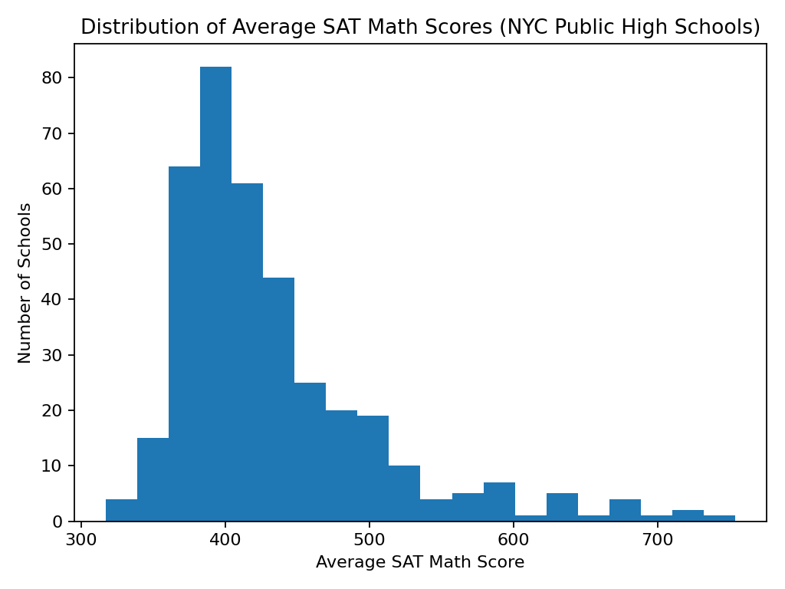
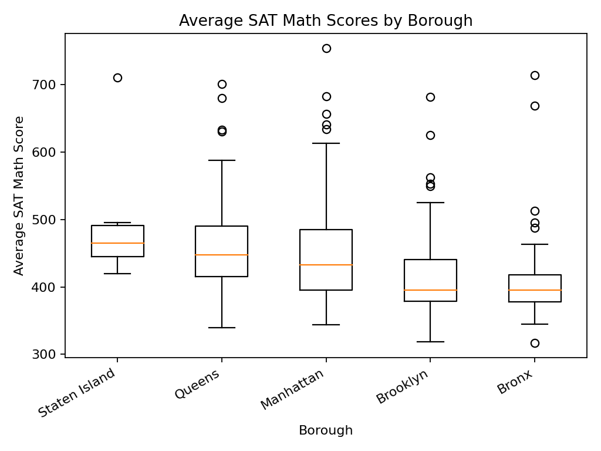
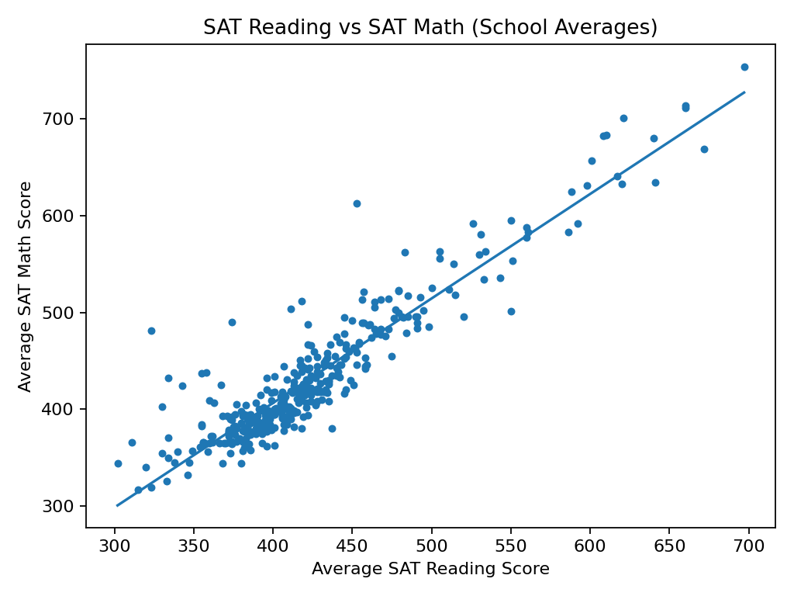

# NYC Public High School SAT Performance Analysis

Statistical analysis of school-level SAT performance across New York City public high schools using **R**.

## Project Overview

This project examines differences and associations in SAT performance across NYC public high schools. The analysis uses public education data and applies descriptive and inferential statistical methods to investigate overall SAT Math performance, differences across boroughs, and relationships between SAT Reading and Math scores.

The project was completed for **STAT E-100: Statistical Methods and Data Analysis at Harvard Extension School**.

## Methods

The analysis includes:

* Data cleaning and preparation in R
* Descriptive statistics and data visualization
* One-sample t-test
* One-way ANOVA
* Pearson correlation
* Simple linear regression
* Chi-square test of independence
* Statistical assumption checking and interpretation

## Key Findings

* NYC public high schools in the analyzed sample had an average SAT Math score significantly below 500.
* SAT Math performance differed significantly across NYC boroughs.
* SAT Reading and SAT Math scores showed a strong positive relationship (**r = 0.928**).
* SAT Reading explained approximately **86.2% of the variation in SAT Math scores (R² = 0.862)**.
* Borough was significantly associated with whether a school's average SAT Math score was below or at/above 500.
  
## Research Figures

### Distribution of Average SAT Math Scores

The distribution is right-skewed, with most NYC public high schools having average SAT Math scores in the low-to-mid 400s.

### SAT Math Scores by Borough

SAT Math performance varies across NYC boroughs, with statistically significant differences in borough-level means.

### SAT Reading vs. SAT Math

SAT Reading and Math scores show a strong positive relationship, with Pearson correlation **r = 0.928** and **R² = 0.862**.

## Tools

* **R**
* Statistical modeling
* Regression analysis
* ANOVA
* Hypothesis testing
* Data visualization
* Reproducible data analysis

## Published Research

The complete research report is publicly archived on Zenodo:

**DOI:** [10.5281/zenodo.22065620](https://doi.org/10.5281/zenodo.22065620)

## Author

**Sara Tonekaboni**
Quantitative Research | Applied Mathematics | Finance
